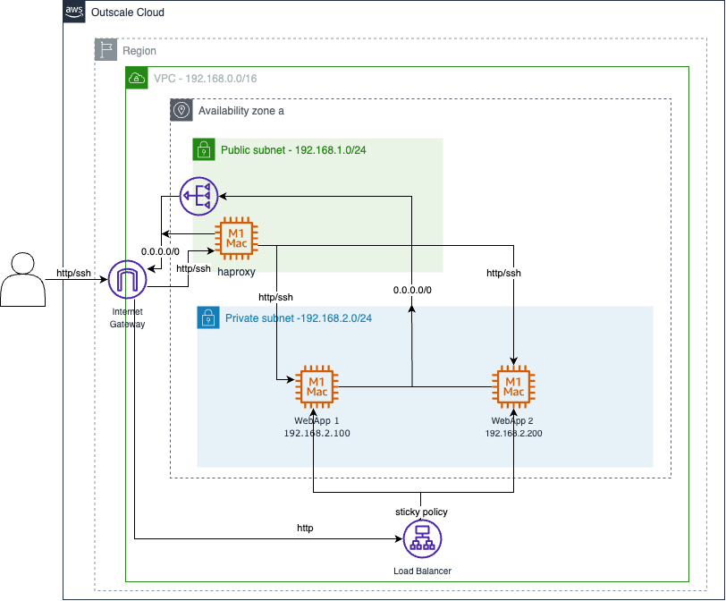

# Load Balancer session persistence in Outscale cloud

## Goal

The goal is to test the behavior of two types of sticky policies for session Persistence in Load Balancer instances:

- Duration-based stickiness
- Application-based stickiness

## Introduction 

[ref](https://docs.aws.amazon.com/elasticloadbalancing/latest/application/sticky-sessions.html)

By default, an Load Balancer routes each request independently to a registered target based on the chosen load-balancing algorithm. However, you can use the sticky session feature (also known as session affinity) to enable the load balancer to bind a user's session to a specific target. This ensures that all requests from the user during the session are sent to the same target. This feature is useful for servers that maintain state information in order to provide a continuous experience to clients. To use sticky sessions, the client must support cookies.

### Duration-based stickiness

Duration-based stickiness routes requests to the same targe using a load balancer generated cookie. The cookie is used to map the session to the target. If your application does not have its own session cookie, you can specify your own stickiness duration and manage how long your load balancer should consistently route the user's request to the same target.

When a load balancer first receives a request from a client, it routes the request to a target (based on the chosen algorithm), and generates a cookie name specified in the load balancer configuration. It encodes information about the selected target, encrypts the cookie, and includes the cookie in the response to the client. 

In subsequent requests, the client should include the cookie. When the load balancer receives a request from a client that contains the cookie, it detects it and routes the request to the same target. If the cookie is present but cannot be decoded, or if it refers to a target that was deregistered or is unhealthy, the load balancer selects a new target and updates the cookie with information about the new target.

### Application-based stickiness

Application-based stickiness gives you the flexibility to set your own criteria for client-target stickiness. When you enable application-based stickiness, the load balancer routes the first request to a target based on the chosen algorithm. The target is expected to set a custom application cookie that matches the cookie configured on the load balancer to enable stickiness. This custom cookie can include any of the cookie attributes required by the application.

When the Load Balancer receives the custom application cookie from the target, it automatically generates a new encrypted application cookie to capture stickiness information. This load balancer generated application cookie captures stickiness information for each target that has application-based stickiness enabled.

In the response to the client, the Load Balancer validates the name with which the custom cookie was configured and the expiry attribute of the custom cookie. As long as the name matches, the load balancer sends both cookies, the custom cookie set by the target, and the application cookie generated by the load balancer, in the response to the client.

In subsequent requests, clients have to send back both cookies to maintain stickiness. The load balancer decrypts the application cookie, and checks whether the configured duration of stickiness is still valid. It then uses the information in the cookie to send the request to the same target to maintain stickiness. The load balancer also proxies the custom application cookie to the target without inspecting or modifying it. 

If a target fails or becomes unhealthy, the load balancer stops routing requests to that target, and chooses a new healthy target based on the chosen load balancing algorithm. The load balancer treats the session as now being "stuck" to the new healthy target, and continues routing requests to the new healthy target even if the failed target comes back.

## Architecture

.

## Requirements

- python3.9
- Flask>=2.2
- Flask-Session>=0.5.0
- gunicorn>=21.2.0

## Terraform

Initialize terraform:

```bash
terraform init
```

Apply terraform recipe:

```bash
terraform apply
```

Destroy terraform resources:

```bash
terraform destroy
```

## Bouncer VM

Check the web service on the web browser by using the public ip of the bouncer VM (Inspect the cookie value and its expiration date).

By default the haproxy uses the APP cookie sticky policy. You can use the LB cookie sticky policy by uncommenting the following line on the haproxy.cfg file:

```
cookie MYCOOKIE insert indirect nocache maxidle 20s maxlife 20s
```

and commenting the line:

```
cookie session prefix indirect nocache
```

Restart the haproxy service to apply the changes. Check the web service again on the web browser (Inspect the cookie value and its expiration date).

## Load Balancer

Now check the load balancer service using its DNS. You have to get the same reponse from the web service as before.

Add Sticy policies into the Load Balancer instance by using the api calls:

to Add a LB cookie sticky policy use [doc](https://docs.outscale.com/lbu#createlbcookiestickinesspolicy): 

```bash
osc-cli lbu CreateLBCookieStickinessPolicy --CookieExpirationPeriod 10 --LoadBalancerName "terraform-balancer" --PolicyName "LBCookie"
```

to Add an APP cookie sticky policy use [doc](https://docs.outscale.com/lbu#createappcookiestickinesspolicy): 

```bash
osc-cli lbu CreateAppCookieStickinessPolicy --CookieName "session" --LoadBalancerName "terraform-balancer" --PolicyName "AppCookie"
```

then set the created sticky policy by using [doc](https://docs.outscale.com/lbu#setloadbalancerpoliciesoflistener):

```bash
osc-cli lbu SetLoadBalancerPoliciesOfListener --LoadBalancerName "terraform-balancer" --LoadBalancerPort 80 --PolicyNames.member.1 "AppCookie"
```

Change `PolicyNames.member.1` to `LBCookie` to use the LB cookie sticky policy instead.

Check the behavior on the web browser by using its DNS (Inspect the cookie value and its expiration date). 

## Recomendations

To access to the private vms, connect first into the public vm (Bouncer vm) usign ssh:

```bash
ssh-add <private_ssh_key>  
ssh -i <private_ssh_key> outscale@<public_ip_bouncer_vm> -A
```

then connect into the public vms:

```bash
ssh <private_ip_private_vm> -A
```